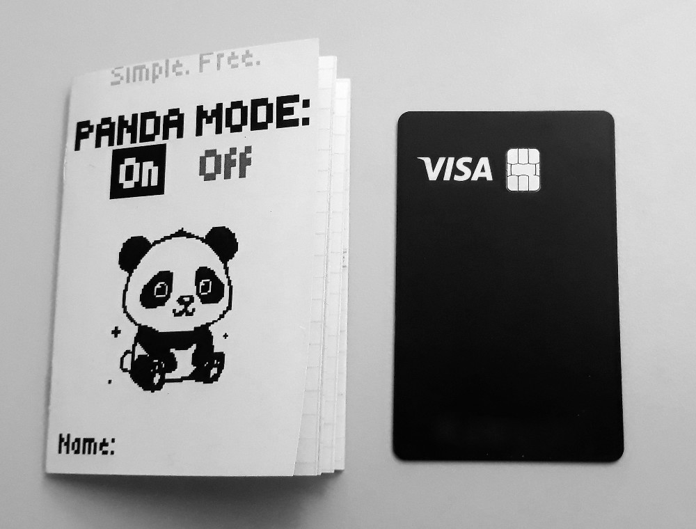
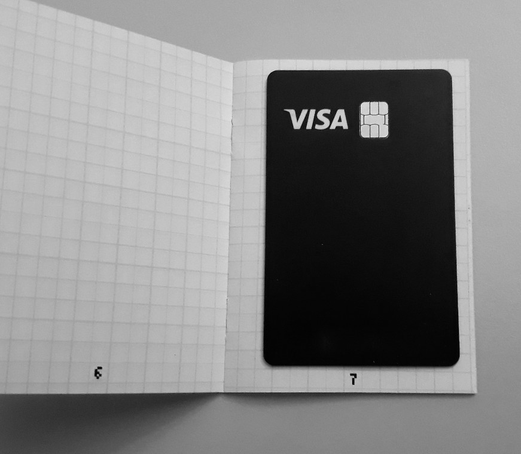

# Panda Notebook

A 16 pages A7 pocket notebook to create from an A4 sheet.

{width=10%}

## Content

- The notebook is slightly smaller than A7 (due to the cuts): roughly 10cm x 7cm.
- It has 16 numbered pages...
    - ...including a cute front cover.
    - The pages 2 to 16 have a 5mm grid.

{width=40%}

{width=40%}

## Requirements

- **A4 sheet**
- **Printer** (grayscale is enough)
- **Stapler** (alternatively: book binding equipment)
- **Scissors** or **paper cutter**

## Instructions

**_Optional_**: edit the vector graphic template [A7-PandaNotebook.svg](images/A7-PandaNotebook.svg) if needed. It was created with the free and open source software [Inkscape](https://inkscape.org/), after observing how pages behave when folding an A4 sheet into A7. If needed, export to PDF at the end.

The instructions are summarized here:

### 1. Printing 🖨️ 

Print the template PDF [A7-PandaNotebook.pdf](A7-PandaNotebook.pdf) **double-sided** on an A4 sheet, **no scaling** (the template PDF is already A4).

### 2. Folding 📃
Following the small squares with the numbers "1", "2" and "3", create the 1st, 2nd and 3rd folds (e.g. the two "1" have to touch each other).

**Remark**: Make the folds as precise as possible by using the middle line on the other side of the number, which becomes an edge once folded. Preferably don't use the outer edges of the A4 sheet, because most printers don't center perfectly the prints.

### 3. Stapling 📌

Using a desk stapler, or a stapler that can open, or even with bookbinding tools (piercing awl, needle and thread), create the binding. I recommand two staples (each 2cm from the border).
If you stapler is too small to reach the middle line, you can gently fold the pages without too much pressure to make the 

### 4. Cutting ✂️

Using scissors, or better: a paper cutter, cut few millimeters of the two edges that are closed to open them.

Tada! You are the happy owner of a tiny cute notebook that fits in your pocket!

## Questions and Answers ❔

- _Why **panda** notebook?_
    - Because it's black and white, I like monochrome; black ink on white paper. Also because a panda embodies being chill and taking things easy. Be a panda.

## License

This work is licensed under a [Creative Commons Attribution-NonCommercial-ShareAlike 4.0 International License](https://creativecommons.org/licenses/by-nc-sa/4.0/).

You are free to:
- **Share** — copy and redistribute the material in any medium or format
- **Adapt** — remix, transform, and build upon the material

Under the following terms:
- **Attribution** — You must give appropriate credit, provide a link to the license, and indicate if changes were made. You may do so in any reasonable manner, but not in any way that suggests the licensor endorses you or your use.
- **NonCommercial** — You may not use the material for commercial purposes.
- **ShareAlike** — If you remix, transform, or build upon the material, you must distribute your contributions under the same license as the original.

For more information, see the [full license text](LICENSE).

