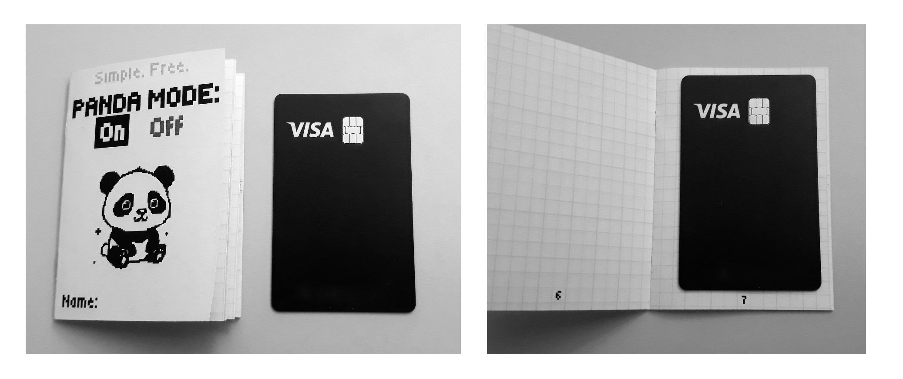
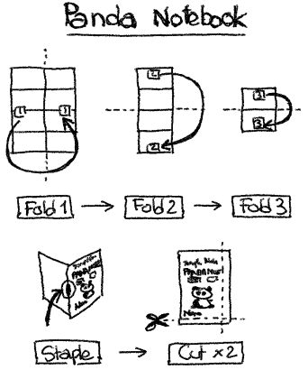

# Panda Notebook

A 16-page A7 pocket notebook you can make from a single A4 sheet.

## Specifications

Here is how the notebook looks like

- The notebook ends up slightly smaller than A7 (due to trimming): roughly 10 cm x 7 cm.
- It has 16 numbered pages...
    - ...including a cute front cover.
    - Pages 2 to 16 have a 5 mm grid.

## Requirements

- **A4 sheet**
- **Printer** (grayscale is enough)
- **Stapler** (alternatively: book binding tools)
- **Scissors** or **paper cutter**

## Instructions

**_Optional_**: edit the vector graphic template [A7-PandaNotebook.svg](images/A7-PandaNotebook.svg) if needed. It was created with the free and open source software [Inkscape](https://inkscape.org/), after observing how pages behave when folding an A4 sheet into A7. If needed, export to PDF at the end.

The instructions are summarized here:

### 1. Printing 🖨️ 

Print the template PDF [A7-PandaNotebook.pdf](A7-PandaNotebook.pdf) **double-sided** on an A4 sheet, **no scaling** (the template PDF is already A4).

### 2. Folding 📃
Using the small squares labeled "1", "2", and "3", make the three folds. For instance, the two "1" have to touch each other.

**Remark**: Use the center line on the reverse side of each number as a guide; it becomes the edge once folded. Avoid using the sheet’s outer edges as reference points; most printers don’t perfectly center prints.

### 3. Stapling 📌

Using a desk stapler, or even with bookbinding tools (piercing awl, needle and thread), create the binding. If you use a stapler, I recommend two staples (each about 2 cm from the border).

**Remark**: If your stapler is too small to reach the middle line, and you cannot open your stapler fully, you can gently bend the pages to make them fit into the stapler, as shown below:

### 4. Cutting ✂️

Using scissors, or better: a paper cutter, cut a few millimeters of the two closed edges to open them.

_Et voilà!_ You now have a tiny, cute notebook that fits in your pocket!

## Roadmap

- A7 template
    - [x] Experiment and create the template
    - [x] Open source it
- A8 template
    - [x] Experiment and create the template
    - [ ] Open source it
- Tool for automatically creating custom A5–A8 templates (e.g., different layout per page, custom cover)
    - [ ] Create a script
    - [ ] Open source it
    - [ ] Host it for everyone to use

## FAQ

- _Why **panda** notebook?_
    - Because it's black and white, I like monochrome aesthetics, like black ink on white paper.
    - Also because a panda embodies being chill and taking things easy.
    - Be a panda.
- _Why create this? What's the point??_
    - Because I'm trying to be less distracted by my phone but still be able to quickly note down ideas, references (books, movies, podcasts, ...) to process later.
    - I realized that a lot of existing notebooks (either digital templates or physical notebooks) are either paid, or limited. For instance, I like the idea of the [PocketMod](https://pocketmod.com/), but I prefer to have more and nicer pages.
    - I started making my own tiny notebooks by folding, binding, and trimming A4 sheets (it reminded me of school), and I found them so useful and fun that I wanted to share them.

## License

This work is licensed under a [Creative Commons Attribution-NonCommercial-ShareAlike 4.0 International License](https://creativecommons.org/licenses/by-nc-sa/4.0/).

You are free to:
- **Share** — copy and redistribute the material in any medium or format
- **Adapt** — remix, transform, and build upon the material

Under the following terms:
- **Attribution** — You must give appropriate credit, provide a link to the license, and indicate if changes were made. You may do so in any reasonable manner, but not in any way that suggests the licensor endorses you or your use.
- **NonCommercial** — You may not use the material for commercial purposes.
- **ShareAlike** — If you remix, transform, or build upon the material, you must distribute your contributions under the same license as the original.

For the full licence text, see [LICENSE](LICENSE).

